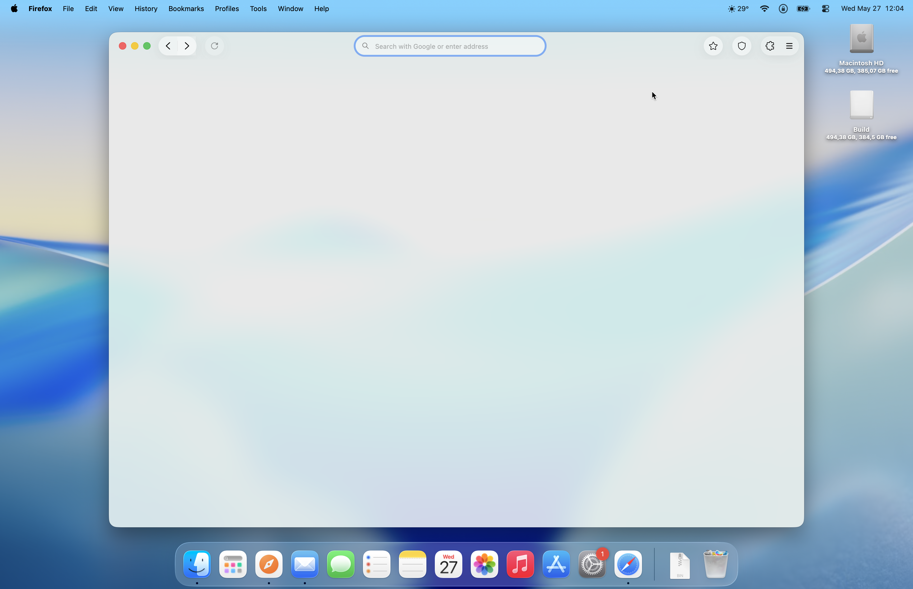
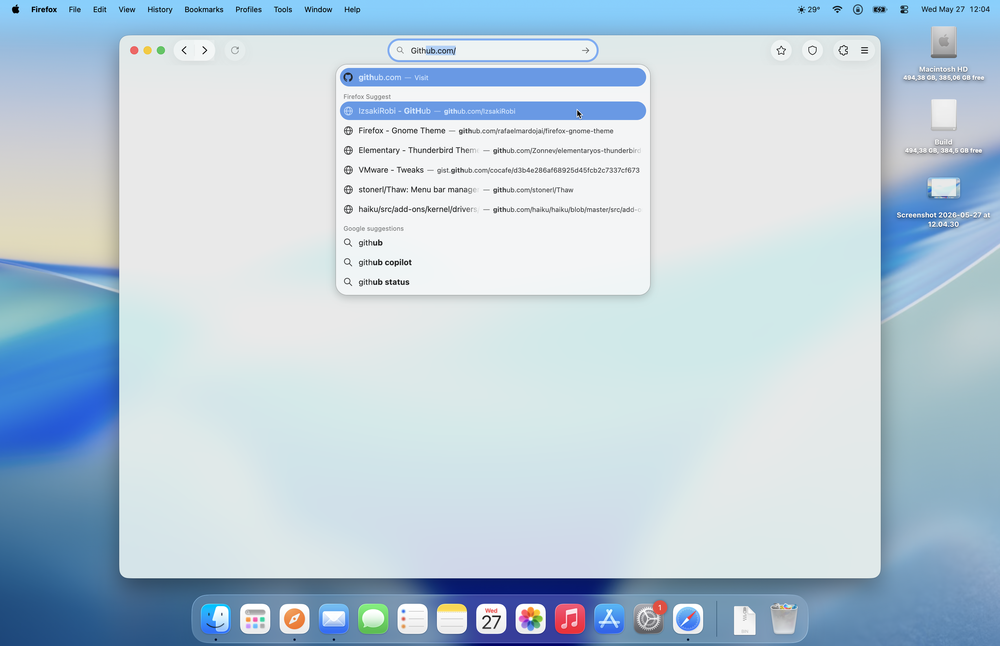
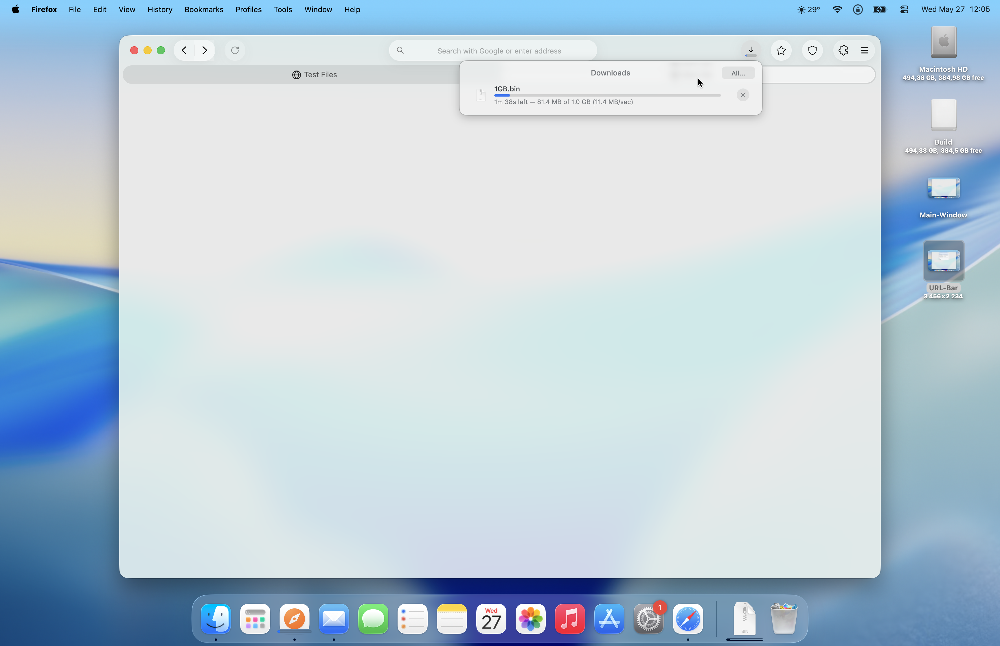

# Firefox-SL

  
  
  

Firefox-SL is a Safari-like Firefox chrome theme for macOS.

## Version

v1.2

## Contents

- `userChrome.css`
- `userContent.css`
- `Icons/`

## Install

1. Open your Firefox profile folder.
2. Create a `chrome` folder if it does not exist.
3. Copy `userChrome.css`, `userContent.css` and the `Icons` folder into `chrome`.
4. Restart Firefox.

Firefox custom styles require `toolkit.legacyUserProfileCustomizations.stylesheets` to be enabled in `about:config`.

## Downloads button

The downloads button appears while a download is active, remains visible for completion notifications and errors, then hides after a successful download. Its toolbar slot stays reserved while hidden, preventing the address bar and Flexible Space items from shifting. The behavior is scoped to the main navigation toolbar and is independent of the surrounding button arrangement.
